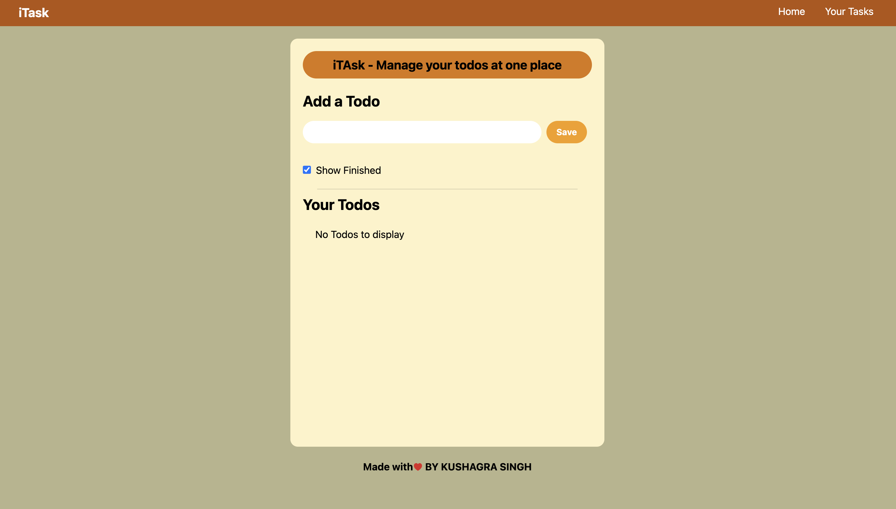
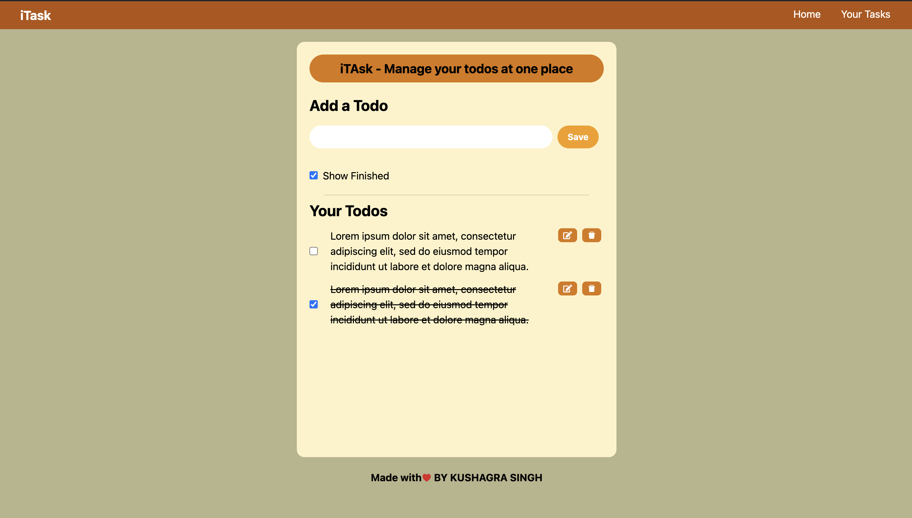

# iTASK---Your-Task-Planner
This is a simple and intuitive Todo App built with React. The app allows users to manage their tasks efficiently with features such as adding, editing, deleting, and marking tasks as completed. This project showcases fundamental React concepts and state management.

## Features

- **Add Tasks:** Easily add new tasks to your todo list.
- **Edit Tasks:** Update the details of your existing tasks.
- **Delete Tasks:** Remove tasks that are no longer needed.
- **Mark as Completed:** Mark tasks as completed to keep track of your progress.
- **Responsive Design:** The app is fully responsive, ensuring a great user experience on both desktop and mobile devices.

## Technologies Used

- **React:** A JavaScript library for building user interfaces.
- **Tailwind CSS:** A utility-first CSS framework for rapid UI development.
- **CSS:** For additional styling.
- **React Hooks:** For managing state and side effects.
- **React Router:** For navigation between different views.

